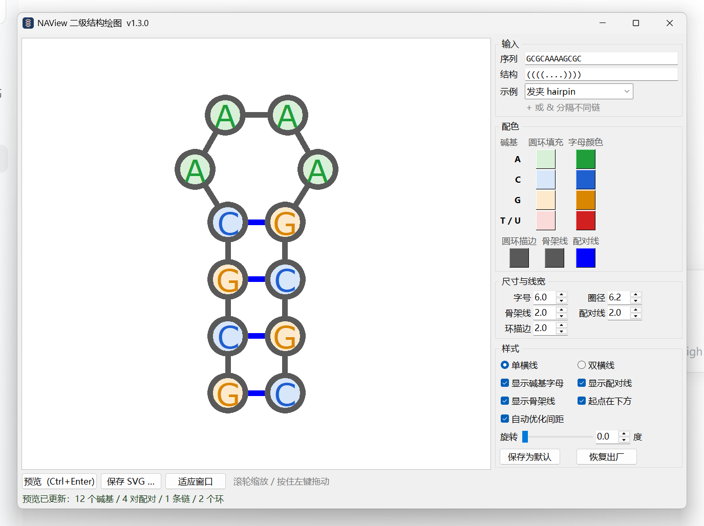
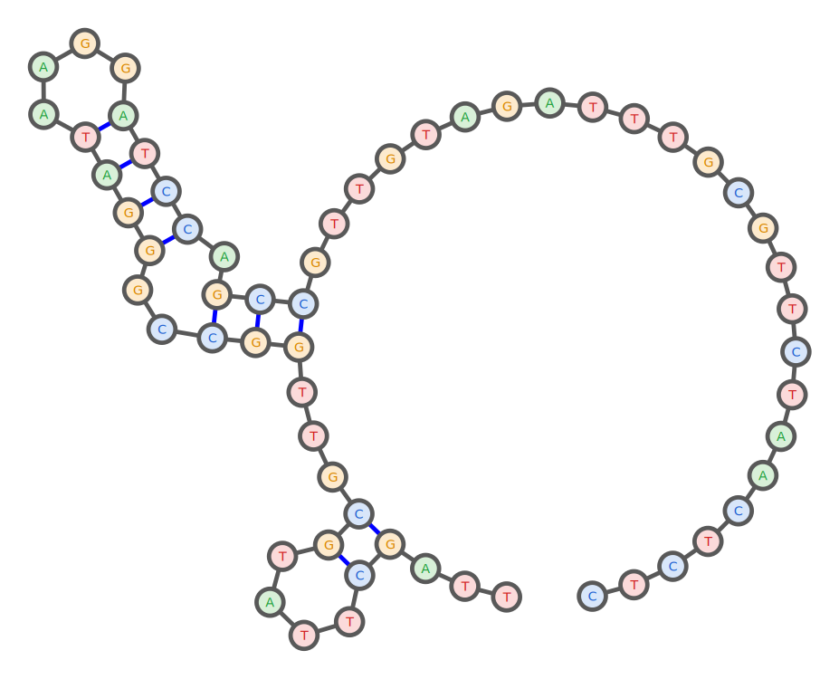

# NAView —— DNA/RNA 二级结构绘图

**简体中文** ｜ [English](README.en.md)

用 Python 实现的 **NAView** 布局算法（Bruccoleri & Heinrich, *CABIOS* 4:167–173, 1988），
把 DNA/RNA 的二级结构画成平面图。带图形界面，也能命令行出图；
Windows 上还有打包好的**免安装 exe**，目标电脑不用装任何东西。

---

## 快速开始

| 我想 | 去哪 |
|---|---|
| **直接画图，不想装 Python** | 下载 [`naview-exe/NAView.exe`](naview-exe/NAView.exe)（约 13 MB，Windows 64 位）→ 双击就能用。详细说明见 [naview-exe/README.md](naview-exe/README.md) |
| **看源码 / 用命令行 / macOS、Linux** | 进 [`naview/`](naview) 文件夹 → 详细说明见 [naview/README.md](naview/README.md) |

exe 版第一次运行可能弹「Windows 已保护你的电脑」，点「**更多信息**」→「**仍要运行**」即可
（没买代码签名证书的个人程序都会这样，买了也一样会弹，详见 exe 版说明）。

---

## 这个仓库里有什么

| 目录 | 内容 | 说明 |
|---|---|---|
| [`naview/`](naview) | **源码**：图形界面 + 命令行 + 布局算法，纯标准库、零第三方依赖 | [中文](naview/README.md) ｜ [English](naview/README.en.md) |
| [`naview-exe/`](naview-exe) | **打包好的 `NAView.exe`**（Windows 64 位免安装） | [中文](naview-exe/README.md) ｜ [English](naview-exe/README.en.md) |

---

## 功能

- 🖥 **图形界面**：左边预览、右边设置；填序列和点括号结构 → 点「预览」→ 存成 SVG
- 🎨 **配色可调**：四种碱基的圆环填充色、字母颜色各自单独改，另有圆环描边 / 骨架线 / 配对线颜色
- 🔠 **尺寸与线宽可调**：字号、圆环半径，以及骨架线 / 配对线 / 环描边三条线宽独立调节
- 🔃 **方向可调**：5′ 端在下方（默认）或上方；另有**任意角度旋转**，碱基字母始终正立
- 📏 **单横线配对**，可在界面里切换成双横线
- 💾 **参数可保存**：一键「保存为默认」，下次打开照旧；参数文件放在程序旁边，跟着文件夹一起拷走
- 📦 **两种用法**：免安装 exe（Windows）或源码（跨平台，Python 3.8+ 带 tkinter 即可）
- ✅ **带自检脚本**：算法 233 项、界面 61 项、参数 41 项，改完跑一遍就知道有没有画坏

---

## 画出来是什么样

下面这条 60 nt 序列（`...((....))...(((..((((....)))).))).........................`）的默认输出：

---

## 系统要求

| | |
|---|---|
| **exe 版** | Windows 10 / 11，64 位。什么都不用装，不联网也能用 |
| **源码版** | Python 3.8 以上，且带 tkinter（Windows 官方安装包默认勾选 `tcl/tk and IDLE`；Ubuntu 需 `sudo apt install python3-tk`） |
| **导出格式** | SVG 矢量图（放大不糊，可再导入 Illustrator / Inkscape / Word） |

---

## 已知限制

- **只画图，不做折叠预测**：结构请先用 NUPACK / ViennaRNA / mfold 等算好再粘进来。
- **不支持假结**：`([)]` 这类交叉配对会直接报错并说明原因。
- **只实现了 NAView 一种布局**，几何与 VARNA 的 `naview` 模式有出入，不是像素级一致。
- 导出只有 SVG；要 PNG 可以再拿 SVG 转（浏览器打开截图，或 `cairosvg`）。

---

## 出处与许可

布局算法出自 R.E. Bruccoleri & G. Heinrich, *Computer Applications in the
Biosciences* **4**(1):167–173, 1988。

参考实现是 `naview.c`（Copyright © 1988 Robert E. Bruccoleri，允许非商业用途的复制），
本项目据此用 Python 重写，不含 GPL 项目（如 VARNA）的代码。
